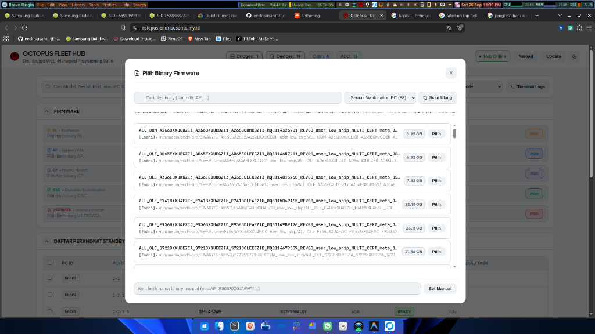

# Octopus

Distributed fleet firmware flashing and provisioning suite for Samsung Android devices across remote Linux (Ubuntu) and Windows workstation nodes.



---

## Features

### Central Web Hub & Dashboard
- **Fleet Management**: Monitor connected devices across multiple bridge PCs simultaneously with real-time status updates via WebSockets.
- **Firmware Slots**: Slot ingestion for `BL`, `AP`, `CP`, `CSC`, and `USERDATA` binaries with automated MD5 verification and background progress tracking.
- **Model Matching**: Automatically matches target devices to uploaded firmware and highlights suggested batches for instant execution.
- **Model Chip Filters**: Quick model filter chips sorted in ascending order, with a thin blue hairline indicator for models currently connected and ready on the bench.
- **Workflow Pipeline Tracking**: Live progress monitoring with dual-ring progress indicators (Odin flash stage and overall workflow progress), per-device AP firmware version display, and live terminal drawer logs.
- **Standby Device Matrix**: Clean table view with sorting, filtering, and model badge indicators.
- **Design**: Minimal interface adhering to antislop and ponytail guidelines, featuring high-contrast light and dark themes with zero layout shifts.

### Native Rust Agent Bridge
- **Ultra-Lightweight**: Native Rust binary with memory footprint under 15MB.
- **Cross-Platform**: Runs on Linux (Ubuntu Debian package / standalone binary) and Windows (NSIS installer / portable executable).
- **Hardware Detection**: Native detection for Odin mode devnodes, ADB endpoints, and Windows COM ports.
- **Silent Auto-Update**: Background self-update support via GitHub Releases and signed manifests.

---

## Architecture

```
octopus/
├── web-hub/
│   ├── client/          # React, Vite, and TypeScript frontend
│   └── server/          # Node.js and WebSocket fleet hub server
├── agent-bridge/        # Native Rust client daemon (Linux and Windows)
├── docs/                # Documentation and screenshots
└── package.json         # Workspace scripts and task orchestration
```

---

## Getting Started

### 1. Run Central Web Hub with Docker
```bash
docker compose up -d
```
- **Web App UI**: `http://localhost:4000` (or `http://localhost:3000` in dev mode)
- **Hub WebSocket Server**: `ws://localhost:4000/ws/ui` and `ws://localhost:4000/ws/bridge`

### 2. Run Local Development Server
```bash
# Install dependencies
npm install

# Start both client and server concurrently
npm run dev
```

### 3. Run Agent Bridge on Worker PC
```bash
cd agent-bridge
cargo run
```

To connect to a specific remote hub and set a custom workstation name:
```bash
HUB_URL=ws://192.168.1.50:4000/ws/bridge PC_ID=WORKSTATION-01 cargo run
```

---

## Release Pipeline

To build and dispatch cross-platform release artifacts (Linux `.deb` & `.rpm`, Windows `.exe`, and update manifest):
```bash
./release.sh
```
Builds are signed and published via GitHub Actions to the [Releases](https://github.com/endrisusanto/octopus/releases) repository.
